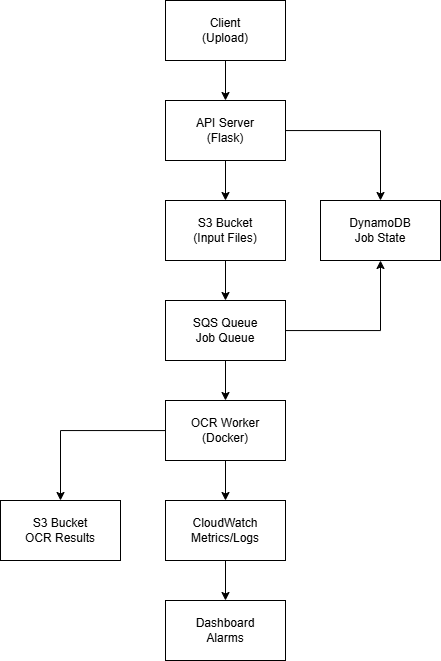
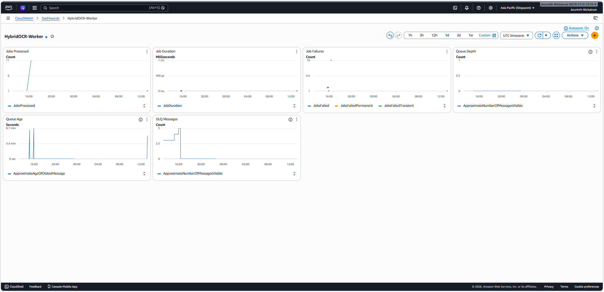
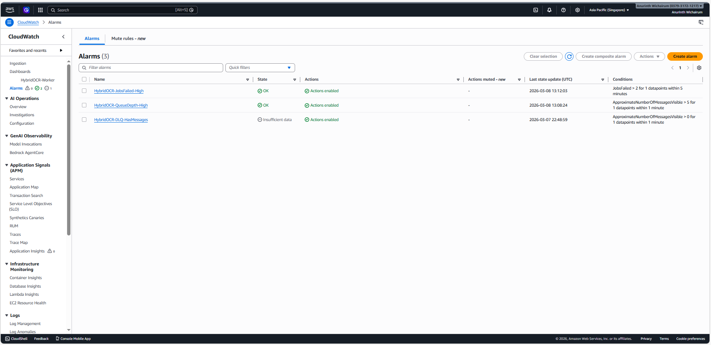

Hybrid OCR Infrastructure
Production-Inspired Asynchronous Processing System (AWS)

==============================================================

Overview

This project is a production-inspired asynchronous OCR processing system built using AWS S3, SQS, and DynamoDB.

It demonstrates:

- Decoupled architecture
- At-least-once delivery handling
- Idempotent worker design
- Conditional writes in DynamoDB
- Failure-aware state transitions
- Dockerized services
- Local orchestration via Docker Compose

--------------------------------------------------------------

Architecture

Architecture Flow

Client
|
v
Flask API
|
|-- Upload file -> S3
|-- Create job (QUEUED) -> DynamoDB
|-- Send message -> SQS
|
v
Worker (poll SQS)
|
|-- Process OCR
|-- Upload result -> S3
|-- Update job (DONE / FAILED) -> DynamoDB
|-- Delete message -> SQS

Design principles:

- DynamoDB is the source of truth
- S3 stores input and result files
- SQS provides async decoupling
- Worker is idempotent
- Safe against crash scenarios

--------------------------------------------------------------

Tech Stack

- Python 3.11
- Flask
- Gunicorn
- boto3
- AWS S3
- AWS SQS
- AWS DynamoDB
- Docker
- Docker Compose

--------------------------------------------------------------

Project Structure

hybrid-ocr/

|-- hybrid-ocr-api/  
|   |-- app.py  
|   |-- Dockerfile  
|   |-- requirements.txt  

|-- hybrid-ocr-worker/  
|   |-- aws_worker.py  
|   |-- Dockerfile  
|   |-- requirements.txt  

|-- docs/  
|   |-- architecture.png  
|   |-- dashboard.png  
|   |-- alarms.png  

|-- docker-compose.yml  
|-- .env.example  
|-- README.md  

--------------------------------------------------------------

Environment Variables

Create a `.env` file in the project root:

OCR_API_KEY=changeme  
OCR_S3_BUCKET=your-bucket-name  
OCR_SQS_URL=https://sqs.ap-southeast-1.amazonaws.com/ACCOUNT_ID/queue-name  
OCR_DDB_TABLE=your-ddb-table  
AWS_REGION=ap-southeast-1  

--------------------------------------------------------------

Running Locally

Build and start both services:

docker compose up --build

API will be available at:

http://localhost:8000

Health check:

curl http://localhost:8000/health

--------------------------------------------------------------

API Endpoints

Create Job

POST /jobs

Header:
x-api-key: <OCR_API_KEY>

Content-Type:
multipart/form-data

Field:
file

Response:

{
"job_id": "...",
"status": "QUEUED"
}

--------------------------------------------------------------

Get Job Status

GET /jobs/<job_id>

Header:
x-api-key: <OCR_API_KEY>

Possible states:

- QUEUED
- PROCESSING
- DONE
- FAILED

If DONE, a presigned S3 download URL is returned.

--------------------------------------------------------------

Failure Handling

This system handles:

- At-least-once delivery (SQS Standard)
- Worker crash before delete_message
- Crash after result upload but before DynamoDB update
- Idempotent job execution

DynamoDB conditional expressions prevent duplicate state transitions.

--------------------------------------------------------------

Observability

CloudWatch Dashboard

The system includes basic observability using CloudWatch metrics and dashboards.

Key metrics monitored:

JobsProcessed  
Number of successfully processed jobs.

JobDuration  
Processing latency.

JobFailures  
Number of failed jobs.

QueueDepth  
Number of messages waiting in the SQS queue.

QueueAge  
Age of the oldest message in the queue.

DLQMessages  
Number of messages in the Dead Letter Queue.

These metrics help monitor system health and worker performance.

--------------------------------------------------------------

CloudWatch Alarms

Configured alarms:

HybridOCR-JobsFailed-High

Triggers when job failures exceed a safe threshold.

HybridOCR-QueueDepth-High

Triggers when the queue grows beyond a defined limit.

HybridOCR-DLQ-HasMessages

Triggers when messages appear in the Dead Letter Queue.

These alarms help detect operational issues early.

--------------------------------------------------------------

Runbook

Operational checks for common issues.

If jobs are not processing

Check queue depth:

CloudWatch → SQS → ApproximateNumberOfMessagesVisible

If the queue keeps increasing, the worker may not be processing jobs.

Check worker logs:

CloudWatch → Logs

Look for events such as:

job_claimed  
job_processing_started  
job_done  
job_failed  

--------------------------------------------------------------

If jobs are failing

Check the JobFailures metric in CloudWatch.

Steps:

1. Inspect worker logs.
2. Identify error_code values.
3. Verify input files exist in S3.
4. Check DynamoDB job state.

Permanent failures should set job status to FAILED.

--------------------------------------------------------------

If messages appear in DLQ

Check the DLQ queue.

Steps:

1. Inspect the failed message.
2. Review worker logs around the failure timestamp.
3. Identify the root cause.
4. Reprocess the job if appropriate.

--------------------------------------------------------------

Engineering Concepts Demonstrated

- Asynchronous processing
- Decoupled architecture
- Message-driven systems
- Visibility timeout awareness
- Idempotent design
- Production-style containerization
- Observability with metrics and alarms

--------------------------------------------------------------

Future Improvements

- Terraform (Infrastructure as Code)
- CI/CD pipeline (GitHub Actions)
- Structured logging
- Retry state handling
- Dead-letter queue automation
- Metrics and monitoring improvements

--------------------------------------------------------------

Author

Anurinth Wichairum

Cloud / DevOps Engineer (Aspiring)

