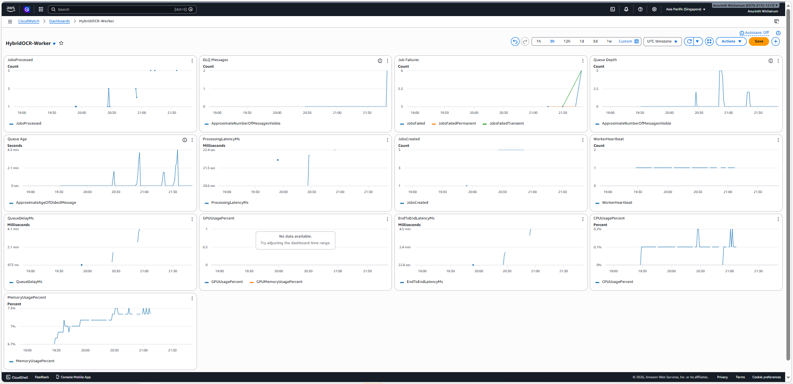

##Hybrid OCR Infrastructure
Production-Inspired Asynchronous Processing System (AWS)

--------------------------------------------------------------

## Overview

This project is a production-inspired asynchronous OCR processing system built using AWS S3, SQS, and DynamoDB.

### it demonstrates:

- Decoupled architecture
- At-least-once delivery handling
- Idempotent worker design
- Conditional writes in DynamoDB
- Failure-aware state transitions
- Dockerized services
- Local orchestration via Docker Compose

--------------------------------------------------------------

## Architecture

### Architecture Flow

Client
|
v
Flask API
|
|-- Upload file -> S3
|-- Create job (QUEUED) -> DynamoDB
|-- Send message -> SQS
|
v
Worker (poll SQS)
|
|-- Process OCR
|-- Upload result -> S3
|-- Update job (DONE / FAILED) -> DynamoDB
|-- Delete message -> SQS

### Design principles:

- DynamoDB is the source of truth
- S3 stores input and result files
- SQS provides async decoupling
- Worker is idempotent
- Safe against crash scenarios

--------------------------------------------------------------

## CI/CD Pipeline

This project uses GitHub Actions for CI/CD.

### CI

On pull requests:

- Python validation (API and Worker)
- Docker build validation
- Terraform validation

### CD

On push to `main`:

1. GitHub Actions assumes an AWS IAM role using **OIDC**
2. Builds Docker images for:
   - `hybrid-ocr-api`
   - `hybrid-ocr-worker`
3. Pushes images to **Amazon ECR**

### Security

AWS authentication is performed using **GitHub OIDC** instead of static credentials.

No AWS access keys are stored in GitHub secrets.

--------------------------------------------------------------

## Tech Stack

- Python 3.11
- Flask
- Gunicorn
- boto3
- AWS S3 / SQS / DynamoDB
- Docker / Docker Compose

--------------------------------------------------------------

## Project Structure

hybrid-ocr/

|-- hybrid-ocr-api/  
|   |-- app.py  
|   |-- Dockerfile  
|   |-- requirements.txt  

|-- hybrid-ocr-worker/  
|   |-- aws_worker.py  
|   |-- Dockerfile  
|   |-- requirements.txt  

|-- docs/  
|   |-- architecture.png  
|   |-- dashboard.png  
|   |-- alarms.png  

|-- docker-compose.yml  
|-- .env.example  
|-- README.md  

--------------------------------------------------------------

## Environment Variables

### Create a `.env` file

OCR_API_KEY=changeme
OCR_S3_BUCKET=your-bucket
OCR_SQS_URL=your-sqs-url
OCR_DDB_TABLE=your-ddb-table
AWS_REGION=ap-southeast-1

--------------------------------------------------------------

## Running Locally

### bash

docker compose up --build

### API

http://localhost:8000

### Health check

curl http://localhost:8000/health

--------------------------------------------------------------

## API Endpoints

### Create Job

POST /jobs

### Header

x-api-key: <OCR_API_KEY>

### Content-Type

multipart/form-data

### Field

file

### Response

{
"job_id": "...",
"status": "QUEUED"
}

--------------------------------------------------------------

## Get Job Status

GET /jobs/<job_id>

### states

- QUEUED
- PROCESSING
- DONE
- FAILED

If DONE → returns presigned S3 URL

--------------------------------------------------------------

## Failure Handling

### Handles

- At-least-once delivery (SQS Standard)
- Worker crash before delete_message
- Crash after upload but before DDB update
- Duplicate message processing

### Mechanism

- Idempotent worker
- DynamoDB conditional writes
- Safe state transitions

--------------------------------------------------------------

## Chaos Testing (Failure Scenarios)

See detailed timeline and results:
[Chaos Test Report](https://docs.google.com/spreadsheets/d/1HH7SjYduQlUfoU6T7efCPeReIEOZ0tc4gKgFm3OhTz8/edit?usp=sharing)

Tested scenarios:

-Worker crash
-Transient failure (retry)
-Permanent failure
-Dead Letter Queue (DLQ)

Results:

-Transient errors are retried and eventually succeed
-Permanent errors are marked FAILED (no retry)
-Messages exceeding retry limit go to DLQ
-No data loss observed during failures

--------------------------------------------------------------

## Failure Behavior Summary

The system was designed to handle real-world distributed system failures:

- Worker crashes do not result in data loss
- Messages may be delivered multiple times (SQS Standard)
- Idempotent processing ensures safe re-execution
- Transient failures are retried automatically
- Permanent failures are not retried
- Poison messages are isolated via DLQ

--------------------------------------------------------------

## Observability

### CloudWatch Dashboard

This dashboard was used during chaos testing to observe system behavior under failure scenarios.

It shows queue backlog growth, retry patterns, and DLQ behavior.

- Queue depth increases when worker is unavailable
- DLQ messages appear after retry exhaustion
- Job failures split into transient vs permanent

## Metrics (CloudWatch)

The system exposes custom metrics to monitor job processing, system health, and queue behavior.

### Job Metrics

- JobsCreated  
  Total number of jobs submitted to the system.

- JobsProcessed  
  Number of successfully completed jobs.

- JobFailures  
  Total number of failed jobs.

- JobsFailedTransient  
  Number of transient failures (retried automatically).

- JobsFailedPermanent  
  Number of permanent failures (not retried).

---

### Latency Metrics

- QueueDelayMs  
  Time spent in queue before a worker starts processing the job.

- ProcessingLatencyMs  
  Time taken by the worker to process the job.

- EndToEndLatencyMs  
  Total time from job creation to completion.

---

### Queue Metrics (SQS)

- QueueDepth  
  Approximate number of messages waiting in the queue  
  (ApproximateNumberOfMessagesVisible)

- QueueAge  
  Age of the oldest message in the queue  
  (ApproximateAgeOfOldestMessage)

- DLQMessages  
  Number of messages in the Dead Letter Queue

---

### Worker Metrics

- WorkerHeartbeat  
  Indicates worker liveness (emitted periodically)

- CPUUsagePercent  
  CPU usage of the worker instance/container

- MemoryUsagePercent  
  Memory usage of the worker

- GPUUsagePercent (optional)  
  GPU utilization (if GPU is enabled)

---

### Failure & Retry Behavior

- ReceiveCount  
  Number of times a message has been received from SQS

- RetryCount  
  Number of retries before success or failure

- TimeToRecoveryMs  
  Time from first failure to successful completion

- TimeToDLQMs  
  Time taken for a message to move to DLQ after repeated failures

---

### Why These Metrics Matter

- Detect backlog growth (QueueDepth, QueueAge)
- Identify slow processing (Latency metrics)
- Monitor system reliability (Failures, DLQ)
- Ensure worker health (Heartbeat, CPU/Memory)
- Validate retry behavior (RetryCount, ReceiveCount)

--------------------------------------------------------------

## CloudWatch Alarms

Configured alarms:

HybridOCR-JobsFailed-High

Triggers when job failures exceed a safe threshold.

HybridOCR-QueueDepth-High

Triggers when the queue grows beyond a defined limit.

HybridOCR-DLQ-HasMessages

Triggers when messages appear in the Dead Letter Queue.

These alarms help detect operational issues early.

--------------------------------------------------------------

## Runbook

Operational checks for common issues.

If jobs are not processing

Check queue depth:

CloudWatch → SQS → ApproximateNumberOfMessagesVisible

If the queue keeps increasing, the worker may not be processing jobs.

Check worker logs:

CloudWatch → Logs

Look for events such as:

job_claimed  
job_processing_started  
job_done  
job_failed  

--------------------------------------------------------------

If jobs are failing

Check the JobFailures metric in CloudWatch.

Steps:

1. Inspect worker logs.
2. Identify error_code values.
3. Verify input files exist in S3.
4. Check DynamoDB job state.

Permanent failures should set job status to FAILED.

--------------------------------------------------------------

### If messages appear in DLQ

Check the DLQ queue.

Steps:

1. Inspect the failed message.
2. Review worker logs around the failure timestamp.
3. Identify the root cause.
4. Reprocess the job if appropriate.

--------------------------------------------------------------

## Engineering Concepts Demonstrated

- Async processing
- Message-driven architecture
- Idempotency
- Failure handling (retry + DLQ)
- Visibility timeout behavior
- Observability (metrics + alarms)

--------------------------------------------------------------

## What This Project Demonstrates

This project demonstrates the ability to design and operate a production-style asynchronous system with:

- Failure handling
- Retry logic
- Observability
- Cloud-native architecture

--------------------------------------------------------------

## Author

### Anurinth Wichairum

Cloud / DevOps Engineer (Aspiring)